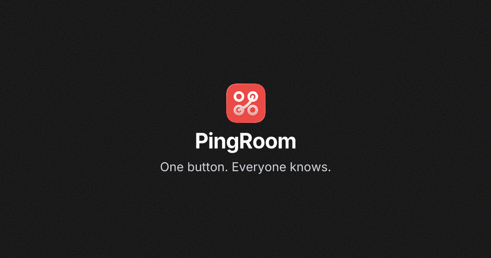

  

<h2 align="center">🔔 PingRoom is live in public beta on TestFlight</h2>

  The bell that cuts through. Spin up a room, hit one button, and everyone knows — instantly. 
  Real-time push notifications with quick actions, webhooks, location & time triggers.

  

  
  &nbsp;
  

  iOS · TestFlight · <a href="https://testflight.apple.com/join/UW186HBe">testflight.apple.com/join/UW186HBe</a> · <a href="https://pingroom.io">pingroom.io</a>

